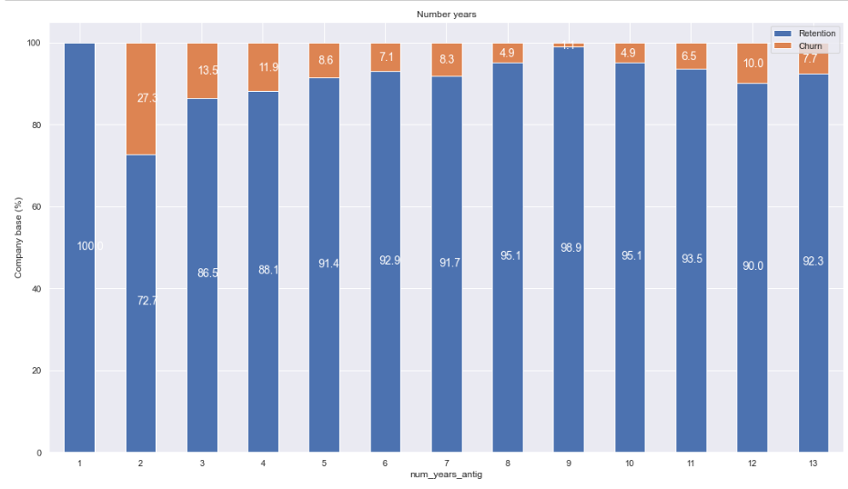

# Energy Company Churn Prediction and Analysis

Welcome to the Energy Company Churn Prediction and Analysis project! This project aims to explore and predict customer churn in an energy company using data analysis and machine learning techniques.

## Overview

The energy industry faces challenges in retaining customers, and predicting churn is crucial for business success. This project combines data analysis, visualization, and machine learning to gain insights into customer behavior and predict potential churn.

## Key Features

- **Data Analysis and Visualization:** Explore customer demographics, consumption patterns, sales channels, and more.
- **Feature Engineering:** Transform data, calculate tenure, and derive meaningful features for modeling.
- **Machine Learning Model:** Utilize a Random Forest Classifier to predict customer churn.
- **Evaluation Metrics:** Assess the model's performance using accuracy, precision, recall, and confusion matrix.
- **Feature Importance:** Visualize and analyze the importance of features in predicting churn.

## Project Structure

- `dataset/`: Contains the dataset used for analysis and modeling.
- `notebooks/`: Jupyter notebooks for exploratory data analysis, feature engineering, and modeling.
- `images/`: Visualizations and plots generated during the analysis.
- `results/`: Output files, including predictions and evaluation results and Executive Summary.
- `business_understanding/`: Business understanding and Task Details.

## Getting Started

1. **Clone the Repository:**
   ```bash
   git clone https://github.com/AyazRao/PowerCo-Churn-Predication-BCG-X-Data-Science-Project.git
   cd energy-churn-prediction

## Task 1: Business Understanding & Hypothesis Framing
- refer to the file in folder 'business_understanding'

## Task 2: Exploratory Data Analysis

### Churn
- About 10% of the total customers have churned. (This sounds about right)


### Sales channel
-Interestingly, the churning customers are distributed over 5 different values for channel_sales. As well as this, the value of MISSING has a churn rate of 7.6%. MISSING indicates a missing value and was added by the team when they were cleaning the dataset. This feature could be an important feature when it comes to building our model.


### Consumption

Let's see the distribution of the consumption in the last year and month. Since the consumption data is univariate, let's use histograms to visualize their distribution.


Clearly, the consumption data is highly positively skewed, presenting a very long right-tail towards the higher values of the distribution. The values on the higher and lower end of the distribution are likely to be outliers. We can use a standard plot to visualise the outliers in more detail. A boxplot is a standardized way of displaying the distribution based on a five number summary:
- Minimum
- First quartile (Q1)
- Median
- Third quartile (Q3)
- Maximum

It can reveal outliers and what their values are. It can also tell us if our data is symmetrical, how tightly our data is grouped and if/how our data is skewed.


### Forecast


Similarly to the consumption plots, we can observe that a lot of the variables are highly positively skewed, creating a very long tail for the higher values. We will make some transformations during the next exercise to correct for this skewness

### Contract type


### Margins


We can see some outliers here as well 

### Subscribed power


### Other columns



