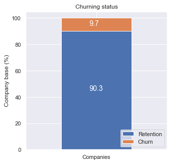

# Energy Company Churn Prediction and Analysis

Welcome to the Energy Company Churn Prediction and Analysis project! This project aims to explore and predict customer churn in an energy company using data analysis and machine learning techniques.

## Overview

The energy industry faces challenges in retaining customers, and predicting churn is crucial for business success. This project combines data analysis, visualization, and machine learning to gain insights into customer behavior and predict potential churn.

## Key Features

- **Data Analysis and Visualization:** Explore customer demographics, consumption patterns, sales channels, and more.
- **Feature Engineering:** Transform data, calculate tenure, and derive meaningful features for modeling.
- **Machine Learning Model:** Utilize a Random Forest Classifier to predict customer churn.
- **Evaluation Metrics:** Assess the model's performance using accuracy, precision, recall, and confusion matrix.
- **Feature Importance:** Visualize and analyze the importance of features in predicting churn.

## Project Structure

- `dataset/`: Contains the dataset used for analysis and modeling.
- `notebooks/`: Jupyter notebooks for exploratory data analysis, feature engineering, and modeling.
- `images/`: Visualizations and plots generated during the analysis.
- `results/`: Output files, including predictions and evaluation results and Executive Summary.
- `business_understanding/`: Business understanding and Task Details.

## Getting Started

1. **Clone the Repository:**
   ```bash
   git clone https://github.com/AyazRao/PowerCo-Churn-Predication-BCG-X-Data-Science-Project.git
   cd energy-churn-prediction

## Task 1: Business Understanding & Hypothesis Framing
- refer to the file in folder 'business_understanding'

## Task 2: Exploratory Data Analysis
